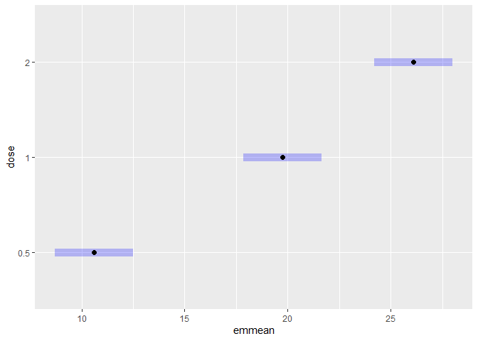
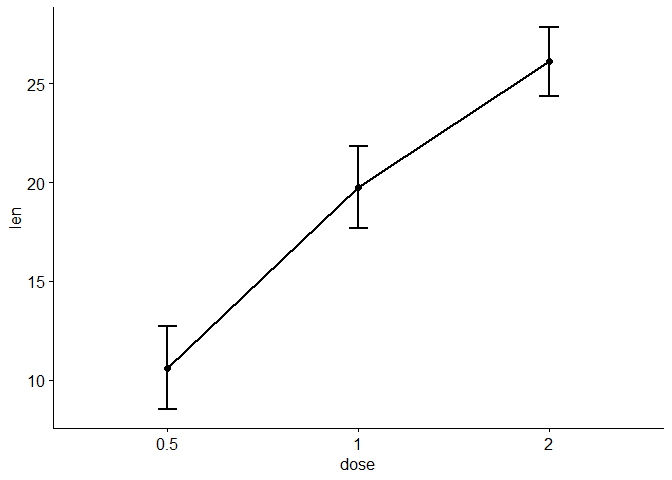
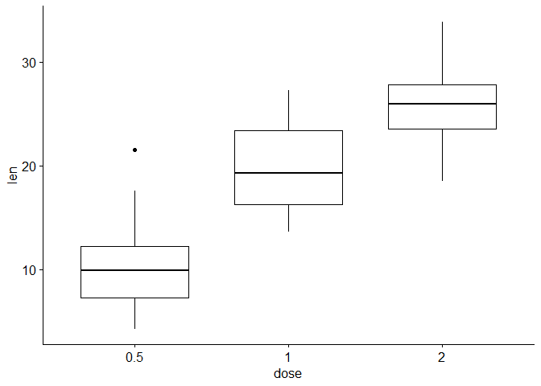

# ONE-WAY ANOVA

## **LOAD LIBRARIES**

``` r
# For everything that is good in R
library(tidyverse)
```

    ## ── Attaching core tidyverse packages ──────────────────────── tidyverse 2.0.0 ──
    ## ✔ dplyr     1.1.2     ✔ readr     2.1.4
    ## ✔ forcats   1.0.0     ✔ stringr   1.5.0
    ## ✔ ggplot2   3.4.2     ✔ tibble    3.2.1
    ## ✔ lubridate 1.9.2     ✔ tidyr     1.3.0
    ## ✔ purrr     1.0.1     
    ## ── Conflicts ────────────────────────────────────────── tidyverse_conflicts() ──
    ## ✖ dplyr::filter() masks stats::filter()
    ## ✖ dplyr::lag()    masks stats::lag()
    ## ℹ Use the conflicted package (<http://conflicted.r-lib.org/>) to force all conflicts to become errors

``` r
# To get useful summary statistics
library(summarytools)
```

    ## 
    ## Attaching package: 'summarytools'
    ## 
    ## The following object is masked from 'package:tibble':
    ## 
    ##     view

``` r
# To visualize data
library(ggpubr)

# To compute estimated marginal means
library(emmeans)

# To write automated statistical reports
library(report)
```

## **ATTACH DATA**

``` r
# Store the Tooth Growth dataset
df <- datasets::ToothGrowth

# Get the structure of the dataset
str(df)
```

    ## 'data.frame':    60 obs. of  3 variables:
    ##  $ len : num  4.2 11.5 7.3 5.8 6.4 10 11.2 11.2 5.2 7 ...
    ##  $ supp: Factor w/ 2 levels "OJ","VC": 2 2 2 2 2 2 2 2 2 2 ...
    ##  $ dose: num  0.5 0.5 0.5 0.5 0.5 0.5 0.5 0.5 0.5 0.5 ...

``` r
# Convert `dose` which has been recognized as numeric to a factor
df$dose <- as.factor(df$dose)

# Attach the dataframe to enable easy calling of variables
attach(df)

# Get the first 6 rows of the dataframe
head(df)
```

    ##    len supp dose
    ## 1  4.2   VC  0.5
    ## 2 11.5   VC  0.5
    ## 3  7.3   VC  0.5
    ## 4  5.8   VC  0.5
    ## 5  6.4   VC  0.5
    ## 6 10.0   VC  0.5

``` r
# Get the last 6 rows of the dataframe
tail(df)
```

    ##     len supp dose
    ## 55 24.8   OJ    2
    ## 56 30.9   OJ    2
    ## 57 26.4   OJ    2
    ## 58 27.3   OJ    2
    ## 59 29.4   OJ    2
    ## 60 23.0   OJ    2

``` r
# Get more information for the dataset
?ToothGrowth
```

    ## starting httpd help server ... done

## **SUMMARY STATISTICS**

``` r
# Use the `dfSummary` function 
summ <- df %>% group_by(dose) %>% dfSummary()
```

## **ANOVA ASSUMPTIONS**

1.  Independence: The observations in each group are independent of each
    other and the observations within groups are obtained by random
    sampling.

2.  Normality: Each sample was drawn from a normally distributed
    population.

    ``` r
    # Runs the Shapiro-Wilk test for normality
    shapiro.test(len[dose==0.5])
    ```

        ## 
        ##  Shapiro-Wilk normality test
        ## 
        ## data:  len[dose == 0.5]
        ## W = 0.94065, p-value = 0.2466

    ``` r
    shapiro.test(len[dose==1])
    ```

        ## 
        ##  Shapiro-Wilk normality test
        ## 
        ## data:  len[dose == 1]
        ## W = 0.93134, p-value = 0.1639

    ``` r
    shapiro.test(len[dose==2])
    ```

        ## 
        ##  Shapiro-Wilk normality test
        ## 
        ## data:  len[dose == 2]
        ## W = 0.97775, p-value = 0.9019

3.  Homogeneity of variances: The variances of the populations that the
    samples come from are equal.

    ``` r
    # Runs the Bartlett test for homogeneity of variances
    bartlett.test(len ~ dose)
    ```

        ## 
        ##  Bartlett test of homogeneity of variances
        ## 
        ## data:  len by dose
        ## Bartlett's K-squared = 0.66547, df = 2, p-value = 0.717

## **ANALYSIS OF VARIANCE**

``` r
# Run our one-way analysis of variance and store results in `fit`
fit <- aov(len ~ dose)

# Automate statistical reporting of the ANOVA
report(fit)
```

    ## The ANOVA (formula: len ~ dose) suggests that:
    ## 
    ##   - The main effect of dose is statistically significant and large (F(2, 57) =
    ## 67.42, p < .001; Eta2 = 0.70, 95% CI [0.59, 1.00])
    ## 
    ## Effect sizes were labelled following Field's (2013) recommendations.

``` r
# Store the estimated marginal means in an object
em <- emmeans(fit, pairwise ~ dose)

# Get results for the estimated marginal means
summary(em)
```

    ## $emmeans
    ##  dose emmean    SE df lower.CL upper.CL
    ##  0.5    10.6 0.949 57     8.71     12.5
    ##  1      19.7 0.949 57    17.84     21.6
    ##  2      26.1 0.949 57    24.20     28.0
    ## 
    ## Confidence level used: 0.95 
    ## 
    ## $contrasts
    ##  contrast        estimate   SE df t.ratio p.value
    ##  dose0.5 - dose1    -9.13 1.34 57  -6.806  <.0001
    ##  dose0.5 - dose2   -15.49 1.34 57 -11.551  <.0001
    ##  dose1 - dose2      -6.37 1.34 57  -4.745  <.0001
    ## 
    ## P value adjustment: tukey method for comparing a family of 3 estimates

``` r
# Get confidence intervals for pairwise EMM differences
confint(em)
```

    ## $emmeans
    ##  dose emmean    SE df lower.CL upper.CL
    ##  0.5    10.6 0.949 57     8.71     12.5
    ##  1      19.7 0.949 57    17.84     21.6
    ##  2      26.1 0.949 57    24.20     28.0
    ## 
    ## Confidence level used: 0.95 
    ## 
    ## $contrasts
    ##  contrast        estimate   SE df lower.CL upper.CL
    ##  dose0.5 - dose1    -9.13 1.34 57   -12.36    -5.90
    ##  dose0.5 - dose2   -15.49 1.34 57   -18.72   -12.27
    ##  dose1 - dose2      -6.37 1.34 57    -9.59    -3.14
    ## 
    ## Confidence level used: 0.95 
    ## Conf-level adjustment: tukey method for comparing a family of 3 estimates

``` r
# Plot EMMs
plot(em)
```

<!-- -->

## PLOTS

``` r
# Plot means with confidence intervals
ggline(data = df,
       x = "dose",
       y = "len",
       add = "mean_ci",
       size = 1)
```

<!-- -->

``` r
# Plot boxplots
ggboxplot(data = df,
          x = "dose",
          y = "len")
```

<!-- -->
